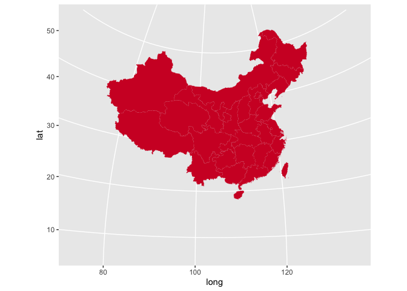
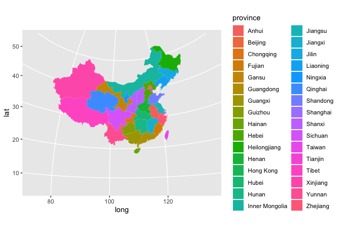

<!-- README.md is generated from README.Rmd. Please edit that file -->

# ChinaMapData

<!-- badges: start -->

<!-- badges: end -->

**ChinaMapData**使绘制标准中国地图更容易！此地图包含南海诸岛和台湾省，重庆市和四川省之间也划清了界限。推荐配合**ggplot2**使用。

``` r
library(ChinaMapData)
library(ggplot2)
china_map_load(1) %>% 
  ggplot(aes(long, lat, group=group))+ 
  geom_polygon(fill='#D11A2D')+
  coord_map('polyconic')
```



## 安装

<!-- You can install the released version of ChinaMapData from [CRAN](https://CRAN.R-project.org) with:

``` r
install.packages("ChinaMapData")
```

And the development version from [GitHub](https://github.com/) with: -->

因为目前功能还很简陋，未来还会有较大改动，所以还是先不打扰CRAN了。如果想体验，可以通过**devtools**安装最新开发版本：

``` r
# install.packages("devtools")
devtools::install_github("TianyiShi2001/ChinaMapData")
```

## 快速上手

源地图数据在`china_map`中，你可以直接获取：

``` r
library(ChinaMapData)
china_map %>% head
#> # A tibble: 6 x 4
#>   province  long   lat group
#>   <chr>    <dbl> <dbl> <chr>
#> 1 黑龙江省  121.  53.3 0.1  
#> 2 黑龙江省  121.  53.3 0.1  
#> 3 黑龙江省  122.  53.3 0.1  
#> 4 黑龙江省  122.  53.3 0.1  
#> 5 黑龙江省  122.  53.3 0.1  
#> 6 黑龙江省  122.  53.3 0.1
```

可见经纬度的精确度很高。虽然可以直接用来绘图，但是速度会较慢，因此提供了一个帮助函数，`china_map_load()`来读取低精度的数据。唯一一个参数为小数点后保留的位数。如精确到小数点后2位：

``` r
china_map_load(2)
```

如果你不喜欢省级行政区的全称，或是需要翻译成其他语言，可用`translate_province`函数（如果这里不提供参数，会把所有语言的全称与简称合并进来）：

``` r
china_map_load(2) %>% translate_province('cn_short') %>% head(3)
#> # A tibble: 3 x 4
#>   province  long   lat group
#>   <chr>    <dbl> <dbl> <chr>
#> 1 黑龙江    121.  53.3 0.1  
#> 2 黑龙江    122.  53.3 0.1  
#> 3 黑龙江    122.  53.3 0.1
```

当然，支持单字简称（与车牌号兼容）！

``` r
china_map_load(2) %>% translate_province('cn_abbr') %>% slice(1, 10000, 50000)
#> # A tibble: 3 x 4
#>   province  long   lat group
#>   <chr>    <dbl> <dbl> <chr>
#> 1 黑        121.  53.3 0.1  
#> 2 蒙        118.  49.8 1.1  
#> 3 苏        121.  32.6 202.1
```

使用ggplot绘制地图超级简单！

``` r
china_map_load(1) %>% 
  translate_province('en_short') %>% 
  ggplot(aes(long, lat, group=group, fill=province))+ 
  geom_polygon()+
  coord_map('polyconic')
```



注意要提供`group=group`这个参数给`aes`。地图是用很多个多边形呈现的。若要描述多个多边形，不仅需要坐标，还需要分组。通过省份分组是不行的，因为沿海省份有附属岛屿，因此一个省份对应多个多边形。
